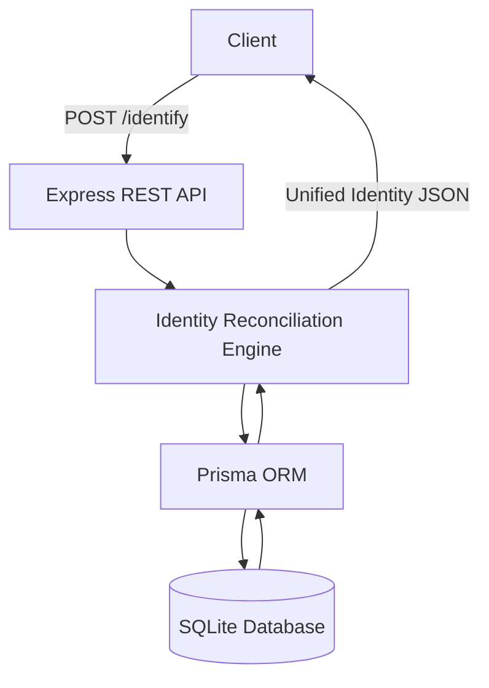

# FluxKart Identity Reconciliation Service
A backend service designed to unify fragmented customer data. This system ensures that whether a customer uses a new email or a different phone number, their identity is linked to a single Primary record. This system simulates how e-commerce or CRM platforms handle duplicate or partially overlapping customer data across sessions.

### Live Endpoint
**URL:** `https://reconciliating-customer-id.onrender.com/identify`  
**Method:** `POST`

## Problem Statement

In real-world e-commerce systems, customers often interact with platforms using inconsistent data:
* **Case A:** Registers with `email_1` and `phone_1`.
* **Case B:** Later orders using `email_1` but a new `phone_2`.
* **Case C:** Eventually uses `email_2` and `phone_2`.

Without an Identity Engine, these appear as **three different people**, leading to duplicate records, broken tracking, and inaccurate analytics. This service solves that by detecting overlaps and maintaining a single record.

## Logic Used

When a request is received at the `/identify` endpoint:

1. **Identity Lookup:** Search for contacts matching the given `email` or `phoneNumber`.
2. **State Evaluation:**
   - **No Match:** Create a new **Primary** contact.
   - **Single/Multiple Match:** Fetch the entire "cluster" of linked contacts.
3. **Reconciliation Rules:**
   - **Oldest Wins:** The contact with the earliest `createdAt` timestamp is designated as the **Primary**.
   - **Primary-to-Secondary Conversion:** If a request links two previously independent Primary contacts, the newer one is demoted to **Secondary** and linked to the older one.
   - **New Attribute:** If the request introduces a new email or phone number that didn't exist in the cluster, a new **Secondary** contact is created.
4. **Response Aggregation:** Consolidate all unique emails, phone numbers, and secondary IDs into a unified JSON structure.


## Technology Stack
- **Runtime:** Node.js
- **Language:** TypeScript
- **Framework:** Express.js
- **Database:** SQLite with Prisma ORM
- **Deployment:** Render.com

## Architecture Overview



### Live Demo
The service is deployed and active at:
**[https://reconciliating-customer-id.onrender.com](https://reconciliating-customer-id.onrender.com)**

## Case 1: Initial Discovery 
### Sample Request Payload (JSON)
```json
{
  "email": "mcfly@hillvalley.edu",
  "phoneNumber": "123456"
}
```
### Sample Response
```json
{
  "contact": {
    "primaryContactId": 1,
    "emails": ["mcfly@hillvalley.edu"],
    "phoneNumbers": ["123456"],
    "secondaryContactIds": []
  }
}
```

## Case 2: Data Extension
### Sample Request Payload (JSON)
```json
{
  "email": "marty@future.com",
  "phoneNumber": "123456"
}
```
### Sample Response
```json
{
  "contact": {
    "primaryContactId": 1,
    "emails": ["mcfly@hillvalley.edu", "marty@future.com"],
    "phoneNumbers": ["123456"],
    "secondaryContactIds": [2]
  }
}
```

## Database Schema

This is the core of the system. This design allows the engine to create a tree-like structure where multiple "Secondary" records point to a single "Primary" record via the `linkedId` field.

```prisma
model Contact {
  id             Int       @id @default(autoincrement())
  phoneNumber    String?
  email          String?
  linkedId       Int?      // Pointer to the Primary Contact ID
  linkPrecedence String    // "primary" or "secondary"
  createdAt      DateTime  @default(now())
  updatedAt      DateTime  @updatedAt
  deletedAt      DateTime?
}
